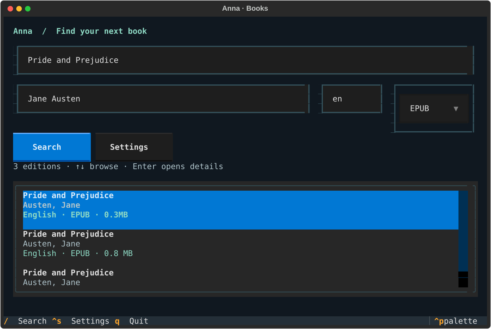

# Anna — Bookfinder

Run `anna` to search, browse editions and download books without copying hashes or
choosing mirrors. This independent fork reuses the Python backend from
[meurz/annas-archive-cli](https://github.com/meurz/annas-archive-cli), with a TUI built
using [Textual](https://textual.textualize.io/).

The interface follows a simple path: **search → results → edition details → download**.
It stays responsive while network work runs in the background.



Bookfinder fills the terminal cell grid. If your terminal adds pixel padding
around that grid, set its padding to zero for a window-edge layout. On wider screens, highlighted editions have a live
details pane; smaller terminals use a full-width details view.

Use it only for public-domain books or files you are otherwise entitled to download.
Catalogue metadata does **not** establish copyright status: check the specific
edition, translation, illustrations and added material before downloading.
The CLI does not certify public-domain status.

## Install this fork

With Python 3.11+ and [uv](https://docs.astral.sh/uv/):

```sh
git clone https://github.com/BowenMilner/annas-archive-cli.git
cd annas-archive-cli
git switch feat/terminal-book-browser
uv sync --locked
uv run anna
```

To make `anna` available outside the checkout:

```sh
uv tool install .
```

If you already installed the upstream package, use `uv tool install --reinstall .`.
This replaces that tool installation. Upstream PyPI and standalone releases do not
include this fork's changes. Nothing in this repository edits your shell configuration.

## Using the terminal browser

```sh
anna
```

Enter a title, optionally enter an author, and press Enter. English and EPUB are
selected initially. Change the format dropdown or language field before searching.
Use `*` or a blank language for all languages, and “Any format” for all formats.
Author filtering recognises surname-first records such as “Austen, Jane”.

| Key / action | Behaviour |
| --- | --- |
| Enter in a search field | Search |
| ↑ / ↓ in results | Move between editions |
| Enter on a result | Focus Download in the wide preview; open details on small screens |
| Tab / Shift+Tab | Move between controls |
| / from results | Return to search |
| Ctrl+S or Settings button | Edit saved preferences |
| F2 | Guided browser check and saved session |
| Escape in a dialog | Go back; cancel an active download |
| q outside text fields / Ctrl+Q anywhere | Quit; cancel first if a download is active |

The details view includes the description, publisher, file metadata and destination
folder. Download totals, list counts and reported issues are fetched from Anna
when available. Missing statistics are labelled unavailable, never invented.
Choose Download to save the selected edition. Real byte progress is shown;
a percentage appears only when the server supplies a reliable file length.
Unknown lengths use an activity indicator rather than an invented percentage.
Free-source countdowns are displayed while waiting. If a file server fails, the
interface shows the next source attempt and resets progress for that source.

Cancel removes unfinished files. An in-flight network operation may need to finish
or reach its timeout before cancellation completes. The results remain available
after a download or cancellation. Network failures, missing sources and filesystem
errors appear in the interface so you can return and try another edition.

Preferences save the language, format and download folder. Changes to search filters
apply to the current session; use Settings to save defaults. The interface needs an
interactive terminal; pipes and automation can use the commands below.

## One-command and scripting use

```sh
anna get "Pride and Prejudice" --author "Jane Austen"
anna get "Frankenstein" --author "Mary Shelley" --format epub
anna get "Pride and Prejudice" --author "Jane Austen" -d ./reading
anna search "Jane Austen"
anna search "Jane Austen" --no-select
```

Both search and get default to English EPUBs. Explicit `--lang`, `--ext` (search)
or `--format` (get) override saved preferences. Author matching uses whole name
words and accepts surname-first entries such as “Austen, Jane”. It filters the
returned page before numbering; it does not fetch extra pages or guarantee an exact
identity match. The default limit is 20 results.

In a terminal, search lets you choose a result immediately. Use `--no-select` for
a listing only. Redirected output and `--json` searches never prompt; `--select`
requests selection explicitly but still requires terminal input.

For scripts, inspect the numbered results and explicitly choose one:

```sh
anna search "Pride and Prejudice Jane Austen" --lang en --ext epub --json
anna get "Pride and Prejudice" --author "Jane Austen" --choose 1 --json
```

`--choose` is one-based, relative to the current filtered results. Results can change
between runs; use a record MD5 or URL with `download` when a stable identifier matters.
Get always requires a deliberate selection; without `--choose`, non-interactive
and JSON calls fail clearly rather than downloading the first match.

## Remember your preferences

```sh
anna config set format epub
anna config set language en
anna config set directory "~/Books"
anna config show
```

Preferences are stored in `~/.config/anna/config.json`, or under
`$XDG_CONFIG_HOME/anna/config.json`. Set `ANNA_CONFIG` to use another file.

```json
{
  "language": "en",
  "format": "epub",
  "directory": "~/Books"
}
```

Command options override preferences, which override built-in defaults. One-off
options are not saved automatically. Only language, format and directory are stored;
cookies and account credentials are never saved here. Invalid preferences produce
a clear error with the file location.

## Existing commands

```sh
anna search "Jane Austen" --lang en --ext epub --limit 5 --no-select
anna search "Pride and Prejudice" --sort smallest --page 2 --json
anna info <MD5-or-record-URL>
anna links <MD5-or-record-URL> --json
anna download <MD5-or-record-URL> --source 2 -o book.epub
anna download <file-URL> -d downloads --md5 <expected-MD5>
anna doctor --json
```

Search, info, links, download and doctor remain available. Replace angle-bracket
placeholders with real values. Search filters `--lang`, `--ext` and `--content` can
be repeated. `--limit` caps records on one page.

**Changed defaults:** downloads now go to `~/Books` or your saved folder rather
than the current directory; use `-d .` for the former behaviour. Search now applies
saved language/format defaults and prompts in a terminal; use explicit filters and
`--no-select` when adapting existing scripts.

`--source` chooses the one-based source from `links`; otherwise download uses the
a listed Libgen file source when available, followed by free partner sources.
Without an explicit `--source`, up to three listed free HTTP sources are tried
after connection failures, access errors or unusable download pages. Checksum failures,
existing files, cancellation and rate limits stop the operation.
Source attempts share a 300-second countdown budget; `--max-wait 0` fails
immediately, and `--max-wait 600` permits a longer wait. Ctrl+C cancels.

Record downloads verify the catalogue MD5. Downloads are streamed to temporary files
and published atomically without overwriting existing files. Empty files,
HTML/JSON/XML responses, length mismatches and checksum failures are rejected.
Temporary files are removed on error or interruption. The destination filesystem
must support hard links. There is no resume support.

## Browser checks without repeated exports

If a site asks for verification, press **F2**, choose **Open Firefox**, finish its
check in Firefox, then return and choose **Use Firefox session**. Anna saves only
that site's cookies and matching browser identity, then retries your last action.
You can also start this setup directly:

```sh
anna connect
```

Automatic import currently supports the default Linux Firefox profile, outside
private windows and containers. Another browser, a customised User-Agent or a
non-standard profile can use the Advanced session-file option: import a Netscape
export once, with that browser's User-Agent. Subsequent launches reuse it.

Sessions live separately under the config folder's `sessions/` directory, with
owner-only files. Unrelated sites' cookies are excluded. Delete that directory to
forget saved sessions and mirror preferences. No browser passwords are read.
The website can require another check after expiry, network/IP changes or changed
browser settings; Anna cannot guarantee permanent clearance or solve the check.

## Official public-domain alternatives

For matching English EPUB titles and authors, Bookfinder checks Project Gutenberg
for an official public-domain record and its advertised illustrated EPUB. Choose
**Download official EPUB** to download that separately labelled
edition, including after archive sources fail. When available, it is the primary
action; **Try archive sources** remains an explicit alternative. It is never
selected silently.

Gutenberg's download count is labelled **last 30 days**; Anna's count belongs to
the selected Anna record. The official EPUB is checked for length, EPUB mimetype
and archive integrity before saving as `gutenberg-<id>-illustrated.epub`. It has
its own identity and is not compared with a different Anna edition's MD5.
Official public-domain metadata refers to the USA; check your jurisdiction and
the specific edition. Availability and matching are not guaranteed.

## Advanced connection options

By default, Anna tries the last successful mirror, or `.gd` first and falls back to `.gl` for connection failures,
blocked pages, HTTP errors or unrecognised layouts. If `.gl` is tried first and
blocked, automatic selection can fall back to `.gd`. A successful mirror is reused
across launches. An HTTP 200 parking page is not accepted as a working
mirror. Genuine empty results do not trigger fallback.

A rate limit stops the request and asks you to try later. The CLI does not route
round it. Mirror availability changes; deterministic tests are independent of live
availability. A successful mirror is remembered; saved sessions stay scoped to
their original site.

Pin a verified mirror only when needed:

```sh
anna --base-url https://annas-archive.gd doctor
anna --timeout 60 get "Pride and Prejudice" --author "Jane Austen"
anna --cookies /path/to/cookies.txt --user-agent "Your browser User-Agent" search "Jane Austen"
```

Global options go before the subcommand. Explicit `--base-url` or `ANNA_BASE_URL`
pins that mirror and disables automatic fallback. Other advanced variables are
`ANNA_COOKIES`, `ANNA_USER_AGENT` and `ANNA_TIMEOUT`.
Cookies remain domain/path/expiry restricted and are not copied between mirrors.
Browser verification may still need manual action; this is not a CAPTCHA solver.
TLS certificate validation remains enabled. httpx supports standard proxy and
certificate environment variables, including SOCKS proxies.

## Scripting contract

`search`, `get`, `info`, `links`, `download` and `doctor` accept `--json`,
including the global position. Data goes to stdout; progress goes to stderr.
JSON operational errors return an error object and status 1. Click usage errors
remain on stderr with status 2. Empty searches return `[]` and status 0.
Configuration commands produce human-readable output.

| Command | JSON result |
| --- | --- |
| search | Array of book records |
| info | Book record, including links |
| links | Array of source records with index, label, url and kind |
| get / download | Object with path, bytes and md5 |
| doctor | Object with base_url, ok and results |

```json
{"error":{"code":"operation_failed","type":"AnnaError","message":"No working mirror found..."}}
```

Existing error codes and JSON fields are preserved; new codes include `download_cancelled`, `download_page_unavailable` and
`download_sources_unavailable`. English error messages are not
stable APIs. Mirror exhaustion reports the failure categories and recovery options;
a pinned mirror retains the original detailed error.

## Development

```sh
uv sync --locked
uv run ruff check .
uv run ruff format --check .
uv run ty check src/anna
uv run pytest -q
uv build
uv run twine check dist/*
```

Tests exercise keyboard navigation, dialogs, settings, download progress and cancellation
through Textual's headless event loop, as well as the existing CLI and networking tests.
They use synthetic data and reduced public HTML fixtures. They never need account
credentials or live mirrors. See [CONTRIBUTING.md](CONTRIBUTING.md),
[SECURITY.md](SECURITY.md) and [CHANGELOG.md](CHANGELOG.md).

The inherited opt-in public-domain acceptance test downloads a Gutenberg EPUB into
a temporary directory, checks the catalogue MD5 and EPUB CRC, then removes it:

```sh
uv run python scripts/live_smoke.py --base-url https://annas-archive.gd
```

Historical upstream evidence is in [live verification](docs/live-verification.md);
it does not establish current mirror availability or acceptance of this fork.
